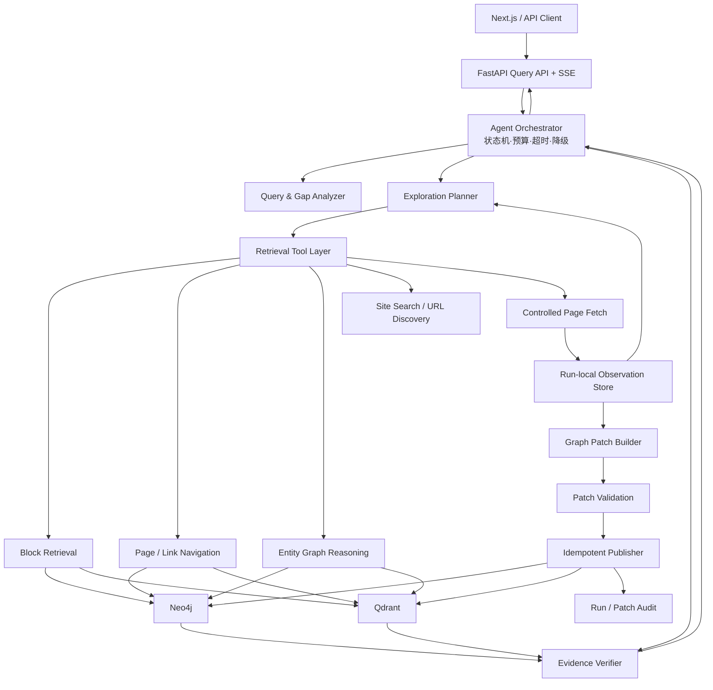
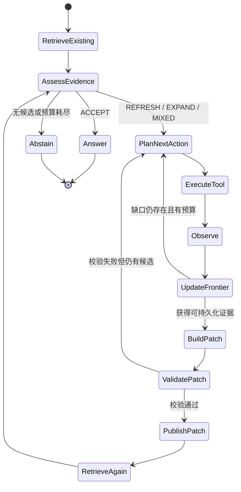
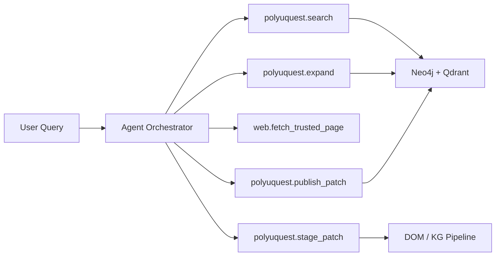
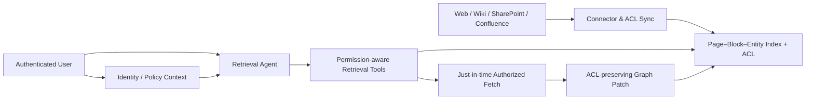

# PolyUQuest 受信任机构信息空间的结构感知自主检索 Agent：MVP 需求与整体架构

## 1. 文档信息

- 文档状态：MVP 产品与系统需求基线
- 最近更新：2026-08-12
- 目标阶段：先验证稳定、可回退的端到端闭环；不以高并发、分布式部署和生产级运维为首版目标
- 依赖底座：PolyUQuest 结构感知图增强 RAG
- 核心闭环：`检索已有知识 → 判断证据缺口 → 探索网页 → 增量建图 → 再检索 → 引用回答`
- 首个落地场景：PolyU 等公共机构网站；后续扩展至带身份与 ACL 的企业内网知识空间

## 2. 背景与问题

PolyUQuest 已通过 WebPage–DOM Block–Entity 三层异构图建模页面超链接、DOM 标题层级与跨页实体关系，并提供块级检索、页面导航和实体多跳推理三类检索链路。

现有系统的知识获取主要依赖预先构建的静态索引。当用户询问以下问题时，系统可能无法给出及时、完整的回答：

- 网页在索引构建后发生更新，例如招生要求、学费、人员和活动信息变化；
- 问题需要访问当前知识图中尚未收录的新页面；
- 已有页面只提供入口，需要继续沿超链接探索详情页面；
- 当前检索结果能够命中相关主题，但不足以覆盖问题的全部子目标。

Web 是实时性较强但内容结构复杂的数据来源。需要在现有图增强 RAG 底座上增加一个查询驱动的检索 Agent，使系统能够在证据不足或时效性不满足时主动探索网页，将新证据写入三层图，并立即用于本次回答及后续查询。

### 2.1 目标信息空间

本系统不面向开放互联网的无边界 Deep Research，而面向具有明确管理主体和访问边界的“受信任机构信息空间”：

- 大学、政府、医院、研究机构等公共网站；
- 企业官网、产品文档站、开发者门户和帮助中心；
- 后续可接入的企业 Wiki、SharePoint、Confluence、内部知识门户等授权数据源。

“受信任”表示来源身份和抓取范围可验证，可以省略开放 Web 中的站点声誉分类、谣言识别、跨来源多数投票等复杂算法；它不表示页面一定相关、最新或无恶意内容。系统仍须执行正文质量、新鲜度、权限、Prompt Injection、实体对齐和写图一致性校验。

### 2.2 当前系统缺口

当前仓库已经具备查询路由、三类检索、网页抓取、DOM 分块、实体抽取/对齐、Neo4j/Qdrant 批量 upsert 和 SSE 输出，但这些能力尚未形成查询期的稳定更新协议：

- 抓取入口面向离线批量构建，缺少单查询、单页面的受控入口；
- `build_id` 与 orphan 清理语义面向全量构建，不能直接复用于局部更新；
- Neo4j 与 Qdrant 没有跨存储事务，需要幂等发布和失败补偿；
- 缺少证据充分性、新鲜度、探索预算和停止条件的统一编排；
- 缺少页面更新后的旧块失效、关系来源合并和后续知识复用验证。

## 3. 产品目标

### 3.1 MVP 目标

1. 根据已有检索结果判断是否存在知识缺口或时效性风险。
2. 将未覆盖需求表示为可验证子目标，在受控动作空间中自主选择查询改写、检索模式切换、链接/实体展开、页面刷新或站内发现。
3. 根据每次检索观察更新 Frontier 和证据状态，在页面、深度、时间和 token 预算内动态重规划并有界停止。
4. 复用现有 DOM 分块、实体抽取、实体对齐及 Neo4j/Qdrant 写入能力，将高价值发现作为可验证 Graph Patch 增量持久化。
5. 新写入的页面、证据块和实体关系能够参与本次查询的第二轮检索，并被后续相关查询复用。
6. 最终答案必须引用具体页面与 DOM 标题路径，并可回放本次 Agent 的检索路径和新增知识。

### 3.2 非目标

MVP 暂不包含：

- 全网无边界搜索或跨任意域名自动建库；
- 多 Agent 协作、长期人格记忆或通用任务执行；
- 分布式爬虫、消息队列、任务调度平台和多租户隔离；
- 对所有网页变更进行实时监听；
- 自动删除或覆盖历史事实；
- 生产级 SLA、高可用和大规模并发优化。

## 4. 用户场景

### 场景 A：已有知识可直接回答

用户提出稳定事实问题。系统从现有图中获得充分、可信且未过期的证据，直接回答，不触发网页探索。

### 场景 B：问题具有明显时效性

用户询问“2026 年最新学费”“当前系主任”“即将举行的活动”等信息。即使已有索引命中，系统发现证据抓取时间过旧，重新访问权威页面，更新相关证据后回答。

### 场景 C：已有证据覆盖不完整

问题包含多个子目标，第一轮检索只覆盖其中一部分。系统从已命中的页面、实体和超链接生成探索计划，抓取缺失详情页并补全答案。

### 场景 D：当前图中没有答案

第一轮检索低相关或无结果。系统执行站内 URL 发现，抓取候选页面并增量建图；如果仍无充分证据，则明确拒答并返回已探索范围。

### 场景 E：后续查询复用新增知识

同一网页已在此前查询中被抓取和建图，且仍满足新鲜度要求。后续查询直接使用已有索引，不重复抓取。

## 5. 系统定位

该功能是建立在 PolyUQuest 图检索底座上的“结构感知自主检索 Agent”，不是对原有结构感知 RAG 的替代，也不是以增量 ETL 为主的后台同步系统。

其核心能力是：面对第一轮检索无法满足的问题，Agent 能显式表示当前信息需求和证据缺口，自主选择下一种检索动作，沿站点结构观察结果、更新检索状态并在硬预算内重规划。增量建图是该检索过程的持久化记忆机制，使本轮新发现的知识可以立即参与再检索并服务后续查询。

三层图仍负责知识表示、检索和溯源；Agent 负责在查询期间决定：

- 现有证据是否足够；
- 下一步应该改写查询、切换检索模式、沿站点图展开、刷新旧页面还是发现新页面；
- 应探索哪些页面、链接或实体路径及其优先级；
- 新观察是否缩小了证据缺口，是否需要重规划；
- 何时停止探索；
- 哪些新证据可以写回知识图；
- 是否需要基于更新后的图重新检索。

### 5.1 设计原则

1. **检索优先，建图服务于检索**：先证明新页面对当前缺口有信息增益，再决定持久化范围。
2. **利用站点结构，而非盲目搜索**：优先复用 `LINKS_TO`、DOM 标题路径、页面类型与实体关系缩小动作空间。
3. **一次执行一个可解释动作**：Planner 产生结构化动作，执行器返回观察，Agent 基于观察重规划。
4. **读取稳定、写入受控**：原有 RAG 读路径保持可用；探索或写图失败不得拖垮查询。
5. **证据驱动停止**：停止依据是子目标覆盖、新鲜度、信息增益和预算，而不是模型自由决定“已经搜够”。
6. **持久化必须可溯源**：所有长期事实均可回溯到 URL、页面版本、DOM Block 和 Agent Run。

### 5.2 相关项目与架构取舍

| 项目/论文 | 可借鉴机制 | 本项目取舍 |
|---|---|---|
| [WebWalker / WebWalkerQA](https://arxiv.org/abs/2501.07572) | 针对层级网站的纵向遍历；Explore–Critic 循环判断是否继续访问子页面 | 作为自主站点遍历与 Agent 测试集设计的首要参考；改为单 Agent 状态机 |
| [MindSearch](https://github.com/InternLM/MindSearch) | WebPlanner 把复杂问题表示为动态子问题图，WebSearcher 执行分层检索 | 复用 Planner/Searcher 职责分离和子目标状态；不采用大规模并行多 Agent |
| [CRAG](https://arxiv.org/abs/2401.15884) | 对第一轮检索进行质量判定，并在低质量时触发 Web 补救 | 仅复用纠错触发思想；扩展为 `ACCEPT/REFRESH/EXPAND/MIXED`，不替换总体评测体系 |
| [Graphiti](https://github.com/getzep/graphiti) | Episode 来源、增量建图、事实有效时间和全链路 provenance | 复用来源批次和时态字段设计；不替换现有三层图与 Neo4j/Qdrant |
| [CocoIndex](https://github.com/cocoindex-io/cocoindex) | 只重算发生变化的数据、变换血缘和失败管理 | 复用 `content_hash`、Delta-only、lineage 和幂等更新思想；MVP 自行实现页面级最小协议 |
| [Pathway](https://github.com/pathwaycom/pathway) | 实时数据连接、增量计算、崩溃恢复和流式 RAG | 作为后续持续同步/实时索引的工程参考；不引入 MVP 运行时 |
| [Onyx](https://github.com/onyx-dot-app/onyx) | 企业连接器、增量同步、文档 ACL 与查询期权限过滤 | 作为企业内网阶段参考；公共机构网站 MVP 暂无用户级 ACL |
| [Microsoft GraphRAG](https://github.com/microsoft/graphrag) / [LightRAG](https://github.com/HKUDS/LightRAG) | 可配置图索引流水线、缓存和增量更新 | 参考索引工作流与缓存；不采用其知识模型，避免丢失 PolyUQuest 的 DOM/页面结构优势 |

最终架构不是上述任一项目的复刻，而是“WebWalker/MindSearch 的自主检索控制 + PolyUQuest 的结构感知检索工具 + Graphiti/CocoIndex 的增量记忆协议”。

## 6. 整体架构

### 6.1 分层架构



架构分为两条相互隔离的路径：

- **稳定读路径**：API → 原有 Router/Retrieval → Answer。未开启探索或证据充分时不经过写路径。
- **受控探索写路径**：Gap Analyzer → Planner → Retrieval Tools → Observation → Graph Patch → 校验/发布 → 再检索。任何阶段失败均回退到稳定读路径或明确拒答。

### 6.2 Agent 自主检索闭环

Agent 的核心不是一次生成完整搜索计划，而是循环执行 `Plan → Act → Observe → Update`：

1. **Plan**：把问题拆成可验证子目标，为每个子目标维护 `unresolved/resolved/stale/conflicted` 状态。
2. **Act**：从受限动作空间中选择一个动作及其目标，不允许自由生成任意工具调用。
3. **Observe**：工具返回检索块、链接、页面摘要、抓取结果和错误，而非直接返回“答案”。
4. **Update**：计算新增证据覆盖、信息增益、候选 Frontier 和剩余预算。
5. **Replan/Stop**：若缺口缩小则继续最有价值的路径；若充分、无增益或预算耗尽则回答/拒答。



### 6.3 控制面与数据面

| 层面 | 职责 | 约束 |
|---|---|---|
| Agent 控制面 | 子目标、动作选择、Frontier、预算、停止和降级 | LLM 仅给结构化建议；最终动作由策略校验器批准 |
| 检索数据面 | 执行块检索、页面导航、图遍历、站内搜索和抓取 | 工具无权修改预算、白名单或 Agent 状态机 |
| 知识更新面 | 构建、校验和发布 Graph Patch | 未变为 `ACTIVE` 的对象不得进入正式检索 |
| 治理面 | 来源边界、ACL（后续）、审计、指标和告警 | 每个观察和事实均关联 `run_id/source_url` |

## 7. Agent 状态与动作

MVP 使用单 Agent、有限状态机和结构化输出，不使用自由形式的无限 ReAct 循环。

### 7.1 AgentState

```python
class AgentState(BaseModel):
    run_id: str
    query: str
    sub_goals: list[str]
    temporal_requirement: str | None
    answer_type: str | None

    retrieved_blocks: list[BlockRef]
    covered_sub_goals: list[str]
    missing_sub_goals: list[str]
    evidence_freshness: dict[str, str]

    candidate_urls: list[CandidateURL]
    visited_urls: list[str]
    frontier: list[FrontierItem]
    action_history: list[AgentAction]
    observations: list[ObservationRef]
    added_page_urls: list[str]
    added_block_ids: list[str]
    patch_ids: list[str]

    iteration: int
    pages_fetched: int
    token_usage: int
    elapsed_ms: int
    stop_reason: str | None
```

### 7.2 允许动作

| 动作 | 作用 | 现有能力映射 |
|---|---|---|
| `RETRIEVE` | 从现有图检索证据 | direct/navigation/reasoning/router |
| `ASSESS_EVIDENCE` | 判断相关性、覆盖度、新鲜度和冲突 | 新增模块 |
| `REWRITE_QUERY` | 针对未解决子目标生成受限检索表达式 | 复用 rewriter，增加子目标上下文 |
| `SWITCH_MODE` | 在块、页面导航、实体推理链路间切换 | router + direct/navigation/reasoning |
| `EXPAND_LINKS` | 从高价值页面展开一跳 `LINKS_TO` 邻居 | Neo4j `get_linked_pages(_batch)` |
| `EXPAND_ENTITY` | 沿命中实体或关系寻找来源页面 | reasoning + Neo4j entity helpers |
| `DISCOVER_URLS` | 从已有页面链接和站内搜索发现候选 URL | crawler + `LINKS_TO`，需增加查询驱动入口 |
| `REFRESH_URL` | 对过期但相关的已知页面执行条件抓取 | crawler，需增加单 URL/ETag 入口 |
| `FETCH_PAGE` | 获取指定页面的最新 HTML 与元数据 | crawler |
| `BUILD_GRAPH_PATCH` | 对已验证观察生成页面范围补丁 | html_processing/kg/storage |
| `PUBLISH_GRAPH_PATCH` | 幂等发布并完成双存储一致性校验 | storage，需新增发布协议 |
| `RETRIEVE_AGAIN` | 让新增知识参与当前查询 | 现有 retrieval |
| `ANSWER` | 基于充分证据生成答案 | 现有生成模块 |
| `ABSTAIN` | 证据不足时拒答并说明探索范围 | 新增响应策略 |

LLM 仅输出结构化计划或判断，实际 URL 校验、预算控制、抓取和写入均由确定性代码执行。

### 7.3 下一动作选择

Planner 对候选动作进行受约束排序，而不是直接生成任意 URL。MVP 可使用如下启发式分数：

```text
utility(action) =
    0.30 × missing_goal_relevance
  + 0.20 × anchor_or_title_match
  + 0.15 × source_authority
  + 0.15 × structural_proximity
  + 0.10 × expected_freshness_gain
  + 0.10 × novelty
  - 0.15 × estimated_cost
  - 0.20 × revisit_or_failure_risk
```

其中 `source_authority` 在 MVP 中主要来自域名/路径配置，而不是通用可信度模型；`structural_proximity` 来自站点图距离和 DOM/页面类型先验。第一版允许规则生成候选、LLM 只对 Top-N 候选重排。

### 7.4 Frontier 与观察记忆

- Frontier 项记录 `target`、`action_type`、`parent_url`、`depth`、`supports_sub_goals`、`score`、`status` 和失败次数；
- 当前 Run 内的抓取结果先进入 Observation Store，不立即写入长期知识库；
- Planner 只接收页面标题、链接、相关 DOM Block 和证据摘要，避免把整页 HTML 反复塞入上下文；
- 同一规范化 URL 在一次 Run 内最多成功访问一次，失败重试受独立上限控制；
- 连续动作的信息增益低于阈值时终止该路径，转向 Frontier 中下一个候选。

## 8. 核心功能需求

### FR-1 查询分析

系统应从问题中提取：

- 关键实体与限定条件；
- 是否包含“当前、最新、今年、即将”等时间敏感信号；
- 可独立验证的子目标；
- 期望答案类型，例如事实、列表、比较或多实体关系。

输出必须为 Pydantic 可校验的 JSON。解析失败时回退为单一子目标，不阻断查询。

#### FR-1.1 领域无关约束协议

核心 Agent 不维护“院系、学位、产品、版本、地区”等固定领域本体，而统一使用：

```python
class QueryConstraint(BaseModel):
    kind: Literal["entity", "qualifier"]
    label: str
    field: str = ""          # 开放字段
    value: str = ""
    aliases: list[str]
    excludes: list[str]
    required: bool = True

class QueryProfile(BaseModel):
    constraints: list[QueryConstraint]
    intents: list[str]
    required_claims: list[EvidenceRequirement]
```

领域信息在请求期规范化为开放字段。例如 `degree_level=PhD` 与 `version=v4` 在核心层都是 qualifier。候选排序检查约束覆盖与冲突，证据判断还要求正文支持对应 intent 和 required claims。

站点身份、入口 URL、入口标题/别名和白名单属于 Connector Profile。更换网站只更换连接器配置；不得向 Agent 状态机添加站点路径或组织缩写判断。

### FR-2 第一轮图检索

系统复用当前查询路由与三类检索链路，返回：

- Top-K 证据块；
- 来源 URL、标题路径和抓取时间；
- 检索模式与分数；
- 已命中的页面、实体与关联链接；
- 各子目标的初步覆盖情况。

### FR-3 证据缺口判断

Evidence Gap Evaluator 至少判断四个维度：

| 维度 | 判断内容 |
|---|---|
| 相关性 | 证据是否直接讨论问题对象和约束 |
| 覆盖度 | 每个子目标是否有至少一个可支持证据 |
| 新鲜度 | 时间敏感问题的页面是否在允许的 TTL 内 |
| 来源质量 | 是否来自允许域名和权威页面，而非错误页或登录页 |

MVP 采用“确定性规则 + LLM 证据判断”组合：

- 无结果、最高分过低、子目标未覆盖或页面过期时直接判为需要探索；
- 其余情况由 LLM 对证据是否足以回答进行结构化判断；
- 判断输出 `sufficient`、`missing_sub_goals`、`stale_urls` 和 `reason`。

### FR-4 网页探索计划

Planner 根据缺失子目标生成带优先级的候选 URL：

1. 第一轮证据页面中的 `LINKS_TO` 邻居；
2. 命中实体的来源页面与相关实体页面；
3. 已知站点入口或栏目页中的候选链接；
4. 若前三类不足，通过可替换的站内搜索/搜索提供方发现 URL。

候选 URL 评分至少考虑：

- 与缺失子目标的语义相关性；
- 锚文本和页面标题匹配度；
- 与权威入口页面的图距离；
- URL 类型优先级，例如 programme、staff、admission、news；
- 是否访问过以及当前图中是否已有新鲜版本。

### FR-5 受控网页抓取

系统只允许抓取配置中的受信任域名，并应用现有 URL 过滤规则。每次抓取必须：

- 拒绝非 HTTP(S)、本地地址、私有 IP 和重定向到非白名单域名的 URL；
- 设置超时、最大响应体和最大重定向次数；
- 过滤登录页、错误页、空壳页面和不支持的文件类型；
- 保存最终 URL、抓取时间、内容哈希及页面元数据；
- 将网页内容视为数据，忽略其中要求 Agent 执行操作或泄露信息的指令。

### FR-6 增量建图

每个成功抓取的页面按以下步骤处理：

1. HTML 清洗及正文提取；
2. 基于 DOM 路径和标题上下文构建证据块；
3. 页面/块内容去重；
4. 页面级实体与关系抽取，并保留 `source_block_refs`；
5. 别名、模糊匹配、向量相似度和临界样本 LLM 判断的实体对齐；
6. 生成 WebPage、Block、Entity、Relation 和 TopicKeyword 向量；
7. 批量写入 Neo4j 和 Qdrant；
8. 执行新写入对象的一致性检查。

MVP 增量更新必须是“页面范围补丁”，不得调用全库 orphan 清理。一次查询只更新本轮访问页面，避免用局部 `build_id` 错误淘汰未访问的全库数据。

### FR-7 数据新鲜度与版本

需要为页面增加或统一以下元数据：

- `fetched_at`
- `content_hash`
- `last_modified`（网页提供时）
- `etag`（网页提供时）
- `source_type`：scheduled/query_driven/manual
- `agent_run_id`

MVP 可按页面类型设置简单 TTL：

- admission、fee、programme：7 天；
- staff、organization：14 天；
- news、events：1 天；
- 无法分类页面：30 天。

内容哈希未变化时只刷新抓取时间，不重复抽取和向量化。内容变化时写入新块，并在回答中只使用当前有效版本。历史版本保留策略放到工程化阶段。

### FR-8 二次检索与答案验证

增量写入完成后，系统必须从 Neo4j/Qdrant 重新执行完整检索，不能直接把抓取原文无条件塞入回答 Prompt。

答案生成前应验证：

- 每个核心结论至少映射到一个证据块；
- 引用 URL 与 DOM 标题路径可返回；
- 存在冲突证据时优先使用更新时间更近、来源更权威的页面，并披露冲突；
- 证据不足时不得根据网页标题或模型常识补全事实。

### FR-9 知识复用

每次成功增量建图后：

- 新页面与证据块保留在现有图和向量库中；
- 后续查询可直接召回；
- 若页面仍在 TTL 内，不重复抓取；
- 响应中返回 `knowledge_reused` 或 `knowledge_added`，便于验证复用效果。

### FR-10 检索动作策略

系统必须根据证据缺口选择成本最低且最可能产生信息增益的动作：

1. 仅检索表达不佳时优先 `REWRITE_QUERY`，不立即访问 Web；
2. 已有证据指向入口页时优先 `EXPAND_LINKS`；
3. 问题包含明确实体链时优先 `EXPAND_ENTITY`；
4. 证据相关但超过 TTL 时优先 `REFRESH_URL`；
5. 图内无有效入口时才调用站内搜索或外部 URL 发现提供方；
6. 抓取新页面后先在 Run 内评估相关性和增益，只有达到持久化门槛才构建 Patch。

每个动作必须记录 `reason`、目标子目标、预计成本、输入来源和实际观察，支持完整轨迹回放。

### FR-11 Graph Patch 发布协议

`GraphPatch` 是一次页面范围的、可重试的知识变更单元，至少包含：

```python
class GraphPatch(BaseModel):
    patch_id: str
    run_id: str
    canonical_url: str
    previous_content_hash: str | None
    content_hash: str
    fetched_at: datetime
    status: Literal["STAGED", "VALIDATED", "PUBLISHING", "ACTIVE", "FAILED"]
    webpages: list[WebPageChange]
    blocks: list[BlockChange]
    entities: list[EntityChange]
    relations: list[RelationChange]
```

发布必须满足：

- 幂等键为 `canonical_url + content_hash + pipeline_version`；
- Neo4j/Qdrant 写入可安全重放，不产生重复节点或向量；
- 发布前检查来源块、实体端点、DOM 路径和向量数量；
- 两个存储均成功并通过读后校验后，Patch 才变为 `ACTIVE`；
- 一侧失败时标记 `FAILED`，记录已写 ID，执行补偿或后续修复；
- Agent 局部 Patch 禁止调用 `delete_orphans(current_build_id)`；
- 内容变化时只失效该 URL 的旧页面版本/旧块，不触碰其他页面。

MVP 可将 Patch 审计信息存为本地 JSONL 或 SQLite；生产阶段再迁移到具备事务与任务状态能力的关系数据库。

### FR-12 故障降级

系统必须区分原 RAG、探索和写图三类故障，返回稳定结果：

| 情况 | 行为 |
|---|---|
| 原 RAG 正常、探索超时 | 返回已有证据的完整/部分回答，标记 `EXPLORATION_FAILED_FALLBACK` |
| 页面抓取失败 | 尝试 Frontier 下一候选；无候选时结束，不阻断服务 |
| Patch 校验或写入失败 | 不让未发布数据参与正式检索；可使用已验证 Observation 生成明确标注的临时回答或拒答 |
| Neo4j/Qdrant 任一不可用 | 禁止新 Patch 变为 `ACTIVE`；保持原有健康存储不被清理 |
| LLM 规划失败 | 回退到规则策略：刷新过期命中页或展开得分最高的一跳链接 |
| 客户端断开 | 取消未开始的 LLM/抓取任务；已进入发布阶段的 Patch 由确定性逻辑完成或标记失败 |

响应状态统一为 `ANSWER_WITH_EXISTING_KNOWLEDGE`、`ANSWER_AFTER_EXPLORATION`、`PARTIAL_ANSWER`、`ABSTAIN` 或 `EXPLORATION_FAILED_FALLBACK`。

## 9. 非功能需求

### NFR-1 可用性与延迟隔离

- `explore_web=false` 时请求行为和延迟分布应与原系统基本一致；
- 探索必须有独立超时，超时后不继续占用回答链路；
- Agent 的失败不得降低原 RAG 的成功率；
- 对同一 URL 的同时刷新应合并为单个 in-flight 工作。

### NFR-2 一致性与幂等

- 重放同一 Patch 不改变最终数据量；
- Neo4j 中的可检索 Block 必须能在 Qdrant 找到对应向量，反之亦然；
- 所有长期实体关系必须具有至少一个有效 `source_block_id`；
- 不完整 Patch 可以检测、修复或隔离，不能静默进入检索。

### NFR-3 安全边界

- 仅允许访问连接器/域名策略授权的资源；
- 防止 SSRF、越权重定向、无限响应体和不支持文件；
- 页面内容永远作为不可信数据，不得修改系统提示、工具权限和预算；
- 日志与 SSE 不记录凭据、Cookie、Authorization Header 或完整敏感页面内容；
- 企业内网阶段必须在检索、图遍历、引用和缓存层同时执行 ACL 过滤。

### NFR-4 可观测性

每个 `run_id` 至少记录：初始路由、子目标、证据判定、动作轨迹、Frontier 变化、抓取结果、Patch 状态、二次检索结果、停止原因、各阶段耗时和 token/页面成本。指标应区分算法失败、外部依赖失败和数据一致性失败。

### NFR-5 可配置与可扩展

域名/连接器、URL 策略、页面 TTL、页面类型、检索工具、Planner/Evaluator 模型、预算和发布后端均应通过配置或接口替换。首版代码不得把 PolyU 的具体路径规则写死在 Agent 状态机中。

## 10. MVP 预算与停止条件

建议默认预算：

| 参数 | 默认值 |
|---|---:|
| 最大探索轮数 | 2 |
| 每轮最大抓取页面 | 3 |
| 单次查询最大抓取页面 | 5 |
| 最大链接扩展深度 | 2 |
| 单页抓取超时 | 30 秒 |
| Agent 总时间预算 | 120 秒 |
| Agent 规划/判断最大 LLM 调用 | 4 次 |
| 最终上下文预算 | 4,000 tokens |

满足任一条件时停止探索：

- 所有子目标均有充分、新鲜证据；
- 达到页面、轮数、时间或 token 预算；
- 连续一轮没有新增页面或有效证据块；
- 候选 URL 均被过滤、访问失败或已访问；
- 检测到来源冲突且无法在预算内解决。

## 11. API 需求

### 11.1 新增请求字段

```json
{
  "query": "What are the latest admission requirements?",
  "explore_web": true,
  "persist_discoveries": true,
  "max_iterations": 2,
  "max_pages": 5,
  "freshness": "auto",
  "source_scope": "configured_trusted_space"
}
```

### 11.2 SSE 事件

在现有 routing、retrieval、evidence、token 和 done 事件基础上增加：

| 事件 | 内容 |
|---|---|
| `gap_assessment` | 是否需要探索、缺失子目标、过期来源 |
| `exploration_plan` | 子目标、Frontier 摘要和剩余预算 |
| `action_selected` | 动作类型、目标、支持的子目标和选择原因 |
| `observation` | 工具结果摘要、信息增益、失败类型和新候选 |
| `frontier_updated` | 已访问/待访问候选数与当前最高优先级路径 |
| `page_fetched` | URL、状态、内容是否变化 |
| `patch_staged` | Patch ID、来源 URL 和待发布对象数量 |
| `patch_published` | Patch 状态与新增/更新页面、块、实体和关系数量 |
| `retrieval_retry` | 第二轮检索模式及证据变化 |
| `verification` | 最终覆盖度、冲突和停止原因 |
| `fallback` | 失败阶段、降级策略和可用的已有证据 |

### 11.3 响应补充字段

```json
{
  "exploration": {
    "run_id": "run_...",
    "triggered": true,
    "iterations": 1,
    "actions": [],
    "visited_urls": [],
    "added_urls": [],
    "patch_ids": [],
    "new_blocks": 0,
    "response_status": "ANSWER_AFTER_EXPLORATION",
    "stop_reason": "evidence_sufficient_after_update"
  }
}
```

## 12. MVP 模块划分

建议新增：

```text
src/agent_rag/agent/
├── schemas.py              # AgentState、计划、证据判断结果
├── orchestrator.py         # 有限状态流程与预算控制
├── query_analyzer.py       # 子目标与时间要求提取
├── evidence_evaluator.py   # 相关性、覆盖度、新鲜度判断
├── retrieval_policy.py     # 下一动作生成、校验与选择
├── frontier.py             # 候选路径、访问状态与信息增益
├── observation_store.py    # Run 内临时证据和页面观察
├── web_explorer.py         # 受控发现与单页抓取
├── graph_patch_builder.py  # 单页增量变更构建与校验
└── patch_publisher.py      # 幂等发布、读后检查与失败补偿
```

现有模块继续作为确定性工具使用，不复制检索和建图逻辑。

### 12.1 与当前代码的映射

| 新架构能力 | 当前代码 | 需要补充 |
|---|---|---|
| 初始路由与多模式检索 | `retrieval/router.py`、`direct.py`、`navigation.py`、`reasoning.py`、`hybrid.py` | 暴露统一 ToolResult 和子目标上下文 |
| 查询改写与候选重排 | `_rewriter.py`、`_reranker.py` | 面向单个缺失子目标调用 |
| 站点图展开 | `Neo4jStore.get_linked_pages(_batch)` | Frontier 入队、深度/重复控制 |
| 页面抓取 | `crawler.crawl_site` | 新增单 URL、条件请求、查询期硬超时入口 |
| DOM 分块与实体构建 | `html_processing/`、`kg/extractor.py`、`kg/resolution.py` | 以 Observation/Patch 为输入，避免直接全局写入 |
| 双存储写入 | `GraphVectorStore.bulk_store_*` | Patch 状态、幂等键、读后校验与补偿 |
| SSE 轨迹 | `api/routes/query_router.py` | 新增动作、观察、Patch 和 fallback 事件 |

当前 `GraphVectorStore` 的类注释虽然描述了基本一致性，但实际写入仍是 Neo4j、Qdrant 顺序调用，不是跨库事务；MVP 必须把这一差异显式封装在 `patch_publisher.py`，不能把现有包装器视为原子提交。

### 12.2 PolyUQuest 作为 Agent Tool Provider

对 Agent 而言，原有 PolyUQuest 不再只是一条“输入问题、输出最终答案”的完整应用，而是一组结构感知检索与知识操作工具。Agent 不直接访问 Neo4j/Qdrant、生成向量或执行 Cypher，而是通过稳定的 typed tool contract 获取观察。

MVP 在同一个 FastAPI/Python 进程内实现 Pydantic Tool，不强制引入 MCP；当工具需要跨进程部署、提供给其他 Agent 或接入通用客户端时，再将同一份输入输出 Schema 暴露为 MCP Tools。现有 `/api/query` 继续保留，作为非 Agent 请求和故障降级入口。



#### Tool 1：`polyuquest.search`

用途：在已有三层图和向量索引中执行检索，只返回检索观察，不在工具内部生成最终答案。

```python
class SearchInput(BaseModel):
    query: str
    sub_goal_id: str | None = None
    mode: Literal["auto", "block", "navigation", "entity", "hybrid"] = "auto"
    top_k: int = 5
    page_types: list[str] = []
    freshness_after: datetime | None = None
    include_frontier_seeds: bool = True
```

```python
class SearchOutput(BaseModel):
    observation_id: str
    route: RouteDecision
    evidence: list[EvidenceBlock]
    frontier_seeds: list[FrontierSeed]
    trace: list[ToolTraceStep]
    elapsed_ms: int
```

`EvidenceBlock` 至少包含：

```json
{
  "block_id": "...",
  "content": "...",
  "heading_path": "Admissions > Requirements",
  "source_url": "https://...",
  "source_title": "...",
  "page_type": "admissions",
  "fetched_at": "2026-08-12T10:00:00Z",
  "content_hash": "...",
  "scores": {
    "dense": 0.81,
    "bm25": 7.2,
    "reranker": 0.92
  },
  "matched_entities": [],
  "supports_sub_goals": ["sg_1"]
}
```

当前 `retrieve_direct/navigation/reasoning/hybrid` 已能返回 `blocks/mode/trace`，但 Tool 化时应去掉 `answer` 和 `answer_prompt`，并补齐 `fetched_at/content_hash/page_type/frontier_seeds`。`query_embedding`、Neo4j/Qdrant Client 和 LLM Client 都是工具内部实现细节，不出现在 Agent 输入中。

#### Tool 2：`polyuquest.expand`

用途：利用已有 `LINKS_TO`、页面来源和实体关系生成下一步候选，而不是立即抓取全部页面。

```python
class ExpandInput(BaseModel):
    sub_goal: str
    source_urls: list[str] = []
    block_ids: list[str] = []
    entity_ids: list[str] = []
    strategy: Literal["page_links", "entity_sources", "both"] = "both"
    max_depth: int = 1
    limit: int = 20
```

```python
class ExpandOutput(BaseModel):
    candidates: list[FrontierSeed]
    exhausted_anchors: list[str]
    trace: list[ToolTraceStep]
```

每个 `FrontierSeed` 返回规范化 URL、标题/锚文本、父页面、边类型、图距离、关联子目标、是否已入库、最后抓取时间和启发式分数。Agent 据此选择一个或少量候选执行下一动作。

#### Tool 3：`web.fetch_trusted_page`

用途：在域名/连接器策略内条件抓取单个页面。

```python
class FetchInput(BaseModel):
    run_id: str
    url: str
    expected_sub_goals: list[str]
    if_none_match: str | None = None
    if_modified_since: str | None = None
    timeout_seconds: int = 30
```

```python
class FetchOutput(BaseModel):
    observation_id: str
    final_url: str
    status: Literal["FETCHED", "NOT_MODIFIED", "FILTERED", "FAILED"]
    fetched_at: datetime
    content_hash: str | None
    metadata: PageMetadata | None
    block_refs: list[str]
    discovered_links: list[FrontierSeed]
    relevance_summary: EvidenceGain
    error: ToolError | None
```

原始 HTML 和完整页面正文保存在执行侧的 Observation Store；默认不直接发送给 Planner LLM。Agent 只看到元数据、相关 Block、发现链接和信息增益，降低上下文成本与 Prompt Injection 暴露面。

#### Tool 4：`polyuquest.stage_patch`

用途：把一个已经验证为有信息增益的 Observation 转换为 Graph Patch 预览，不立即进入正式索引。

```python
class StagePatchInput(BaseModel):
    run_id: str
    observation_id: str
    persist_level: Literal["blocks_only", "blocks_entities", "full_graph"]
```

```python
class StagePatchOutput(BaseModel):
    patch_id: str
    status: Literal["STAGED", "VALIDATED", "REJECTED"]
    counts: PatchCounts
    provenance_coverage: float
    validation_errors: list[str]
    warnings: list[str]
```

#### Tool 5：`polyuquest.publish_patch`

用途：幂等发布已验证 Patch，并返回两个存储的一致性结果。

```python
class PublishPatchInput(BaseModel):
    run_id: str
    patch_id: str
```

```python
class PublishPatchOutput(BaseModel):
    patch_id: str
    status: Literal["ACTIVE", "FAILED", "REPAIR_REQUIRED"]
    neo4j_written: int
    qdrant_written: int
    consistency_check: ConsistencyResult
    retryable: bool
```

发布成功后，Agent 必须再次调用 `polyuquest.search`，证明新增知识已经从正式索引召回。Agent 不允许根据 `publish_patch` 的对象计数推断答案。

#### 可选 Tool：`polyuquest.compose_answer`

最终回答生成也可封装为受限工具，输入仅为用户问题和 Agent 选定的 `block_id/observation_id`，输出答案、引用和未获支持的声明。MVP 也可以由 Orchestrator 直接复用现有生成 Prompt；无论采用哪种形式，答案生成器不能自行触发抓取或写图。

### 12.3 工具边界规则

- Agent 决定“为什么调用、下一步调用什么”；PolyUQuest Tool 决定“如何安全、确定性地执行”；
- `search` 是只读工具，必须可以高频调用且不会改变知识库；
- `fetch` 产生 Run-local Observation，不等同于长期写入；
- `stage_patch/publish_patch` 是显式的写工具，权限和审计级别高于检索工具；
- 不向 Agent 暴露任意 Cypher、Qdrant Filter、文件路径、请求 Header 或无限制 URL 抓取；
- 所有 Tool 输出统一携带 `run_id/observation_id` 或 `patch_id`、耗时、错误类型和可重试标记；
- MCP 只是一种传输与发现协议，不改变上述业务契约或安全边界。

### 12.4 现有 Pipeline 的复用与改造策略

本次 Agent 改造遵循“保留算法实现、抽取可组合能力、增加编排与安全边界”的原则，不重新实现一套 RAG。

#### 改造前后流程

原有固定问答 Pipeline：

```text
QueryRequest(query, mode?, history?)
  → route_query
  → embed_query
  → retrieve_direct / navigation / reasoning / hybrid
  → rerank + context assembly
  → answer generation
  → QueryResponse(answer, blocks, mode, trace, metadata)
```

原有接口并非只输出 `answer`，还返回证据块、检索模式、子查询/实体扩展信息和 Pipeline Trace；但路由、检索、证据选择与答案生成由固定代码一次执行，调用者无法在中途根据观察选择下一动作。

Agent 化后的可组合流程：

```text
User Query
  → Agent decomposes sub-goals
  → polyuquest.search(skip answer)
  → assess evidence gap
  → polyuquest.expand / rewrite / switch mode
  → web.fetch_trusted_page
  → observe evidence gain and replan
  → optional stage_patch + publish_patch
  → polyuquest.search again
  → compose cited answer
```

核心变化是把原来的一次固定执行拆成多次可观察、可选择、可停止的工具调用；底层 Dense/BM25、图遍历、重排、DOM 分块和实体对齐算法保持复用。

#### 复用分级

| 类型 | 模块/能力 | 改造方式 |
|---|---|---|
| 直接复用 | BGE-M3 embedding、BM25、Qwen3-Reranker、MMR、Neo4j/Qdrant 查询 | 保持算法和配置不变，由 Tool 内部调用 |
| 直接复用 | `route_query` 与置信度路由 | 作为 `search(mode=auto)` 的内部默认策略；Agent 仍可显式切换 mode |
| 轻量适配 | `retrieve_direct/navigation/reasoning/hybrid` | 统一成只读 `SearchOutput`；调用 `skip_answer=True`，不向 Agent 返回 answer prompt |
| 轻量适配 | `_rewriter.py` | 从面向完整问题改为可接受 `sub_goal + prior_observation`，并增加重复改写去重 |
| 轻量适配 | `Neo4jStore.get_linked_pages(_batch)` 和实体邻居查询 | 封装成 `expand`，补候选来源、图距离、访问状态和 Frontier 分数 |
| 轻量适配 | `crawler.crawl_site` 与 URL Filter | 增加单 URL、条件请求、查询期超时和结构化错误；保留离线批量入口 |
| 轻量适配 | `html_processing/`、`kg/extractor.py`、`kg/resolution.py` | 输入改为 Observation，输出 Patch 数据，不在中间阶段直接发布 |
| 受控复用 | `GraphVectorStore.bulk_store_*` | 仅由 Patch Publisher 调用；增加幂等、状态、读后检查和补偿 |
| 新增 | Query Analyzer、Evidence Evaluator、Retrieval Policy、Frontier | 构成 Agent 的决策与搜索状态层 |
| 新增 | Observation Store、Graph Patch、Patch Publisher | 构成临时观察与持久化记忆层 |

#### 推荐代码边界

```text
src/agent_rag/
├── retrieval/                  # 保留现有检索算法
│   ├── router.py
│   ├── direct.py
│   ├── navigation.py
│   ├── reasoning.py
│   └── hybrid.py
├── tools/                      # 新增：稳定的 Agent Tool 适配层
│   ├── schemas.py              # 公共 Tool Input/Output
│   ├── search.py               # 包装 router + retrieval
│   ├── expand.py               # 包装页面/实体图展开
│   ├── fetch.py                # 包装受控单页抓取
│   └── graph_patch.py          # stage / publish facade
├── agent/                      # 新增：只负责决策和状态，不含底层检索算法
│   ├── orchestrator.py
│   ├── query_analyzer.py
│   ├── evidence_evaluator.py
│   ├── retrieval_policy.py
│   ├── frontier.py
│   └── observation_store.py
└── api/
    ├── routes/query_router.py   # 保留原普通问答接口
    └── routes/agent_router.py   # 新增 Agent + SSE 入口
```

`retrieval/` 不依赖 `agent/`，保证原 Pipeline 可以独立运行；`tools/` 依赖现有领域模块并统一错误/Schema；`agent/` 只依赖 `tools/` 的公开契约，不直接 import Neo4j/Qdrant Store。这样未来将 `tools/` 暴露为 MCP Server 时，不需要重写 Agent 策略。

#### 两种服务模式并存

| 模式 | 入口 | 用途 | 是否允许探索/写图 |
|---|---|---|---|
| 原有问答模式 | `POST /api/query`、`/api/query/stream` | 低延迟普通问答、对照实验、Agent 故障降级 | 否 |
| Agent 模式 | `POST /api/agent/query`、`/api/agent/query/stream` | 证据不足、时效性或知识缺失场景 | 按请求和策略控制 |

Agent 模式的第一步仍调用原有检索 Tool；只有证据评估为 `REFRESH/EXPAND/MIXED` 才进入探索。`explore_web=false` 或 Agent 内部故障时，行为应收敛到原有问答模式。

#### Tool 粒度取舍

MVP 对 Planner 暴露五个高层工具，而不是把所有底层方法逐个注册为 Tool：

```text
polyuquest.search
polyuquest.expand
web.fetch_trusted_page
polyuquest.stage_patch
polyuquest.publish_patch
```

`search` 内部用 `mode` 区分块、页面导航、实体推理和混合检索。这样既保留 Agent 的策略空间，又避免模型在多个参数相似的搜索工具之间频繁误选。embedding、单条 upsert、任意 Cypher/Qdrant Filter、全库 orphan 清理等底层方法始终不作为 Tool 暴露。

#### 复用验收要求

1. Tool 化前后，在固定 Query、mode、索引快照和配置下，Top-K `block_id` 与排序应保持一致，允许的差异仅来自新增元数据字段。
2. `polyuquest.search` 不调用答案生成 LLM；其 token 与延迟统计应只包含路由、改写和检索相关阶段。
3. 原 `/api/query` 的响应 Schema 和主要行为保持向后兼容。
4. Agent 层不得复制 Dense/BM25、reranker、图遍历、DOM 分块或实体对齐算法。
5. 将 tools 替换为本地 Python 调用或 MCP 调用时，AgentState 和决策策略结果保持协议级兼容。

## 13. 实现顺序

### 阶段 1A：自主检索闭环（不持久化）

1. 扩展查询请求，加入 `explore_web` 和预算参数。
2. 实现基于规则的缺口判断：无结果、低分、过期或子目标缺失。
3. 把现有三类检索、查询改写和 `LINKS_TO` 展开封装为受限 Agent Tool。
4. 实现 Frontier 和单步 `Plan → Act → Observe → Update`，最多执行两轮、每轮一个检索动作。
5. 新页面先进入 Run 内 Observation，验证能补充缺失子目标。
6. 直接从已验证 Observation 生成带临时引用的答案；任一步失败时回退原 RAG。
7. 用“动作准确率、目标页成功率、每动作证据增益和有界终止率”验证 Agent 确实会自主检索。

### 阶段 1B：增量记忆闭环

1. 对 1A 中已验证的高价值 Observation 构建页面范围 Graph Patch。
2. 实现 Patch 校验、幂等发布和 Neo4j/Qdrant 双存储读后检查。
3. 发布成功后必须重新从正式索引检索，不直接依赖 Run 内临时证据回答。
4. 验证同一查询和相关查询可以复用新增知识，且不会重复抓取未变化页面。
5. 注入单侧写入失败，验证未完成 Patch 不会进入正式检索并可被修复。

### 阶段 2：Agent 决策增强

1. 增加 LLM 子目标分解和结构化证据判断。
2. 增加动作效用排序、URL 语义排序与站内搜索适配器。
3. 增加实体关系探索、信息增益估计和多轮重规划。
4. 增加冲突证据处理、部分回答和拒答策略。

### 阶段 3：工程化（MVP 验证后）

- 将抓取与建图拆分为异步任务；
- 引入任务队列、幂等键、写入事务和失败恢复；
- 建立页面版本、事实时态和回滚机制；
- 增加抓取配额、租户隔离、权限和审计；
- 建立定时刷新与查询驱动更新的混合策略；
- 增加监控、告警、压测和容量规划。

## 14. 验收标准

### 14.1 功能验收

1. 已有且新鲜的答案不触发抓取。
2. 时间敏感且证据过期的问题能够触发指定页面重新抓取。
3. 图中缺失的问题能够沿已有链接发现至少一个新页面。
4. 新页面经过结构化分块和实体抽取后写入 Neo4j/Qdrant。
5. 本次回答实际引用新增页面中的证据块。
6. 第二次相同查询不重复抓取，并能从图中直接回答。
7. 抓取失败、预算耗尽或证据不足时能够正常结束并明确拒答。
8. 非白名单 URL、私有地址和不支持文件不会被访问。
9. 每次探索都能回放“缺口—动作—观察—重规划—停止”的完整轨迹。
10. Agent 探索、LLM 或写图失败时，原有 RAG 查询仍能返回可预测的降级结果。
11. 重放同一 Patch 不重复创建节点、关系或向量。
12. 未通过一致性校验的 Patch 不会参与后续正式检索。

### 14.2 自主检索与问答质量

构建一个至少 30 题的 Agent MVP 测试集：

- 10 题：现有图可直接回答；
- 10 题：页面已更新或证据过期；
- 10 题：当前图缺页，需要探索后回答。

至少统计：

| 指标 | 定义 |
|---|---|
| Gap Detection Precision/Recall | 是否正确触发网页探索 |
| Action Selection Accuracy | 是否选择了正确的改写、模式切换、链接展开、实体展开或刷新动作 |
| URL Discovery Recall@K | 候选 URL 是否覆盖答案页面 |
| Target Page Success@Budget | 在给定页面/轮数预算内是否访问到目标证据页 |
| Search Path Efficiency | 实际访问页数相对最短/标注路径长度的开销 |
| Evidence Gain per Action | 每次动作新增覆盖的子目标或黄金证据量 |
| Evidence Coverage | 子目标被有效证据覆盖的比例 |
| Answer Correctness/Faithfulness | 最终答案正确性与引用支持度 |
| Exploration Success Rate | 探索后由不可答变为可答的比例 |
| Knowledge Reuse Rate | 第二次查询无需抓取即可回答的比例 |
| Pages per Query | 每次 Agent 查询访问页面数 |
| Tokens per Query | 规划、判断和生成总 token |
| End-to-End Latency | 首轮检索、探索、建图和回答总耗时 |

现有 PolyU 300 题继续评估静态问答质量与原系统回归；另构建 30–60 题 Agent 子集，标注 `should_explore`、`expected_action`、`target_urls`、`gold_path`、`missing_sub_goals` 和复用配对。CRAG 的评估器准确率和动作消融可作为补充，但不能替代上述端到端检索与工程指标。

### 14.3 工程稳定性与安全

| 指标 | MVP 目标 |
|---|---:|
| 原 RAG 回归成功率 | 不低于未接入 Agent 的版本 |
| 探索失败后的可控降级率 | 100% |
| Agent 运行有界终止率 | 100% |
| 重放 Patch 的重复写入率 | 0 |
| `ACTIVE` 数据的 Neo4j/Qdrant 不一致率 | 0 |
| 无有效来源事实写入率 | 0 |
| 未授权 URL 实际访问次数 | 0 |
| 网页 Prompt Injection 导致越权动作次数 | 0 |
| 相同未变化 URL 重复抽取/嵌入率 | 接近 0 |
| 失败 Run/Patch 可追踪率 | 100% |

稳定性测试必须注入抓取超时、HTTP 错误、LLM 非法 JSON、Neo4j 单侧失败、Qdrant 单侧失败、重复请求、客户端断开和恶意页面指令。

### 14.4 适用性验证

除 PolyU 主站外，选择至少一个结构不同但同样受信任的机构文档站进行小规模迁移验证；只允许修改连接器、域名/URL、页面类型、TTL 和抽取配置，不应修改 Agent 状态机核心代码。企业内网 ACL 不属于首版通过条件，但所有数据模型和 ToolResult 必须预留 `source_id`、`tenant_id`、`acl_principals` 字段。

### 14.5 首版通过条件

- 30 题均能在预算约束下终止，无无限循环；
- 直接可答问题中至少 90% 不触发探索；
- 缺页问题中至少 70% 能发现包含黄金证据的页面；
- 至少 80% 的探索动作能够使缺失子目标覆盖或候选质量单调提升；
- 成功探索的问题中，新证据能够在本次二次检索中出现；
- 第二轮相同问题的知识复用率达到 90%；
- 所有事实性回答均能返回页面 URL 和 DOM 标题路径。
- 探索与 Patch 故障注入均不导致原有查询接口崩溃或未验证数据发布。

## 15. 关键风险

### 错误知识污染

网页抓取成功不代表内容可信。MVP 只允许受控域名，并要求实体、关系和答案保留块级来源。低质量页面不得因一次查询直接覆盖高质量事实。

### 局部更新破坏全库

现有 `build_id` 适合完整离线构建。查询驱动更新必须采用页面范围补丁，不能在局部抓取后执行全库 orphan 删除。

### Prompt Injection

网页文本只能作为待抽取资料。网页中出现的“忽略规则、执行命令、访问其他 URL、输出密钥”等内容不得进入 Agent 控制指令。

### Agent 成本失控

所有规划、探索、抓取和重试均必须有硬预算。优先使用确定性规则和现有图链接缩小搜索范围，仅在证据判断和复杂规划处调用 LLM。

### 时态冲突

同一实体可能在不同时间拥有不同属性。MVP 至少保留抓取时间和来源，并在冲突时优先最新权威来源；完整事实时态模型留到工程化阶段。

### 搜索策略退化

Agent 可能反复改写相同查询、访问同类列表页或在浅层相关页面间循环。需要 URL/查询规范化、动作去重、Frontier 失败惩罚、信息增益阈值和路径级停止条件。

### 双存储部分发布

Neo4j 与 Qdrant 不具备共同事务，任何顺序写入都有部分成功风险。需要 Patch 状态机、读后校验、补偿记录和检索期 `ACTIVE` 过滤；不能仅依赖批量 upsert 的幂等性。

### 企业权限泄漏

推广到企业内网后，来源可靠不能替代权限校验。ACL 必须随文档和块同步，并在向量召回、图遍历、缓存、引用和答案生成各层执行 security trimming；公共机构网站 MVP 不得宣称已解决该问题。

## 16. 企业内网演进架构

公共机构网站 MVP 采用匿名受信任域名；企业内网阶段增加 Connector Gateway、Identity/Policy Service 和权限感知索引：



演进原则：连接器使用服务身份同步时必须保留源 ACL；Agent 使用用户身份即时访问时不得提升权限；权限撤销优先于内容刷新，撤销后索引内容应立即不可检索。

## 17. 简历表述

### 17.1 当前处于设计/MVP 开发阶段

不要把尚未实现的闭环写成已经上线。可以表述为：

> 在结构感知图增强 RAG 底座上设计面向受信任机构信息空间的自主检索 Agent，将块检索、站点图导航、实体推理和受控网页抓取抽象为可组合工具；通过子目标/证据缺口状态、Frontier 动作选择与预算化重规划形成“检索—观察—探索—再检索”闭环，并以幂等 Graph Patch 将新发现知识供当前问答和后续查询复用。

### 17.2 MVP 验收通过后

> 基于三层异构图实现受预算约束的自主检索 Agent，依据子目标覆盖、新鲜度与检索观察动态选择查询改写、模式切换、链接/实体展开和页面刷新动作；通过可回放搜索轨迹、幂等 Graph Patch、Neo4j/Qdrant 一致性校验与故障降级，使新增网页知识在当前回答中即时生效并被后续查询复用。

如果取得量化结果，再追加：

> 在包含静态可答、知识过期和图中缺页场景的 Agent 测试集上，取得 X% 知识缺口识别准确率、Y% 探索成功率和 Z% 二次查询知识复用率，并将平均探索页面数控制在 N 页以内。
